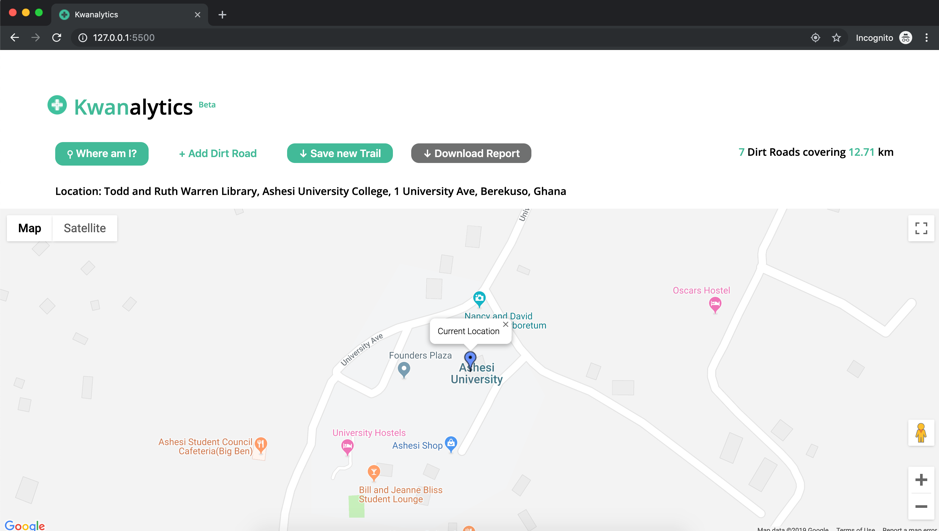
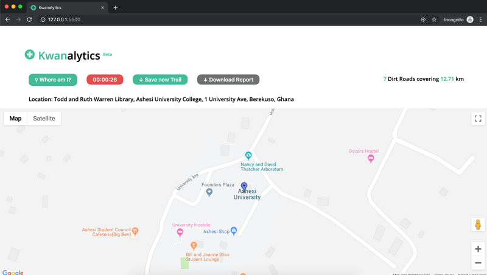
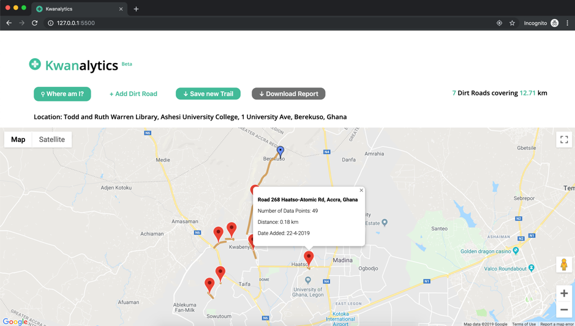
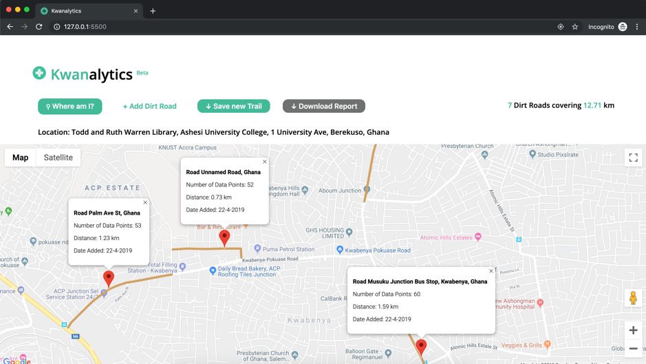

# Kwanalytics 
Kwanalytics is a Geographic Information System which charts out dirt roads in Ghana using crowd-source GPS information.

With Kwanalytics, users (citizens ideally) will be able to track and view dirt roads in their local communities. The data gathered will prove useful for Ghana's Ministry of Roads and Highways' policy-making. 

**Fun Fact:** The project name, *Kwanalytics*, is a portmanteau formed from *Kwan* (Akan word for 'road') and *Analytics* (English for...analytics)

## Usage
This app can be accessed at https://kwanalytics.kevin-deyoungster.now.sh/  

To run locally, you would have to:
- Put your Google Maps API key in `index.html` and `script.js`
- Replace the MLab Mongo API connection strings with yours, in `script.js`

## Screenshots

*Main View*

*Tracking Mode - user is actively tracking a dirt road*

*Dirt Road Tracked*

*View of all tracked dirt roads*

